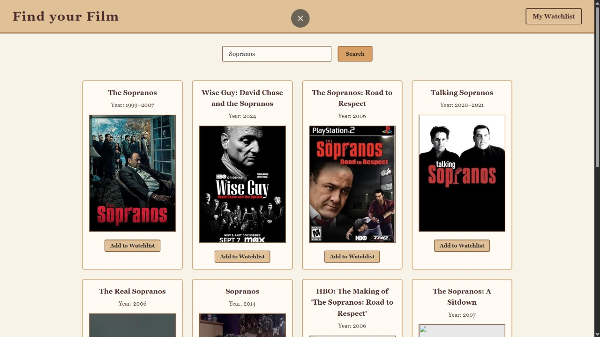
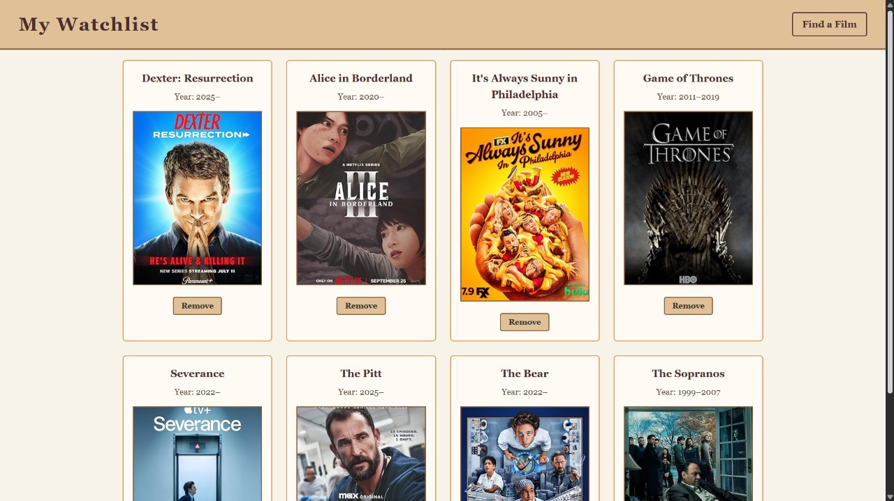

# 🎬 Movie Watchlist

A simple **Movie Watchlist Web App** built with vanilla **HTML, CSS, and JavaScript**.  
Search for movies using the [OMDb API](https://www.omdbapi.com/), view details, and save your favorite titles to your personal **watchlist** stored in `localStorage`.

---

## ✨ Features

- 🔍 **Search Movies** — Enter a movie name and fetch results instantly from OMDb.  
- 🖼️ **Movie Posters** — Displays movie posters (with a fallback placeholder if unavailable).  
- ➕ **Add to Watchlist** — Save your favorite movies with a single click.  
- 📂 **My Watchlist Page** — View your saved collection across browser sessions (thanks to `localStorage`).  
- 🗑️ **Remove from Watchlist** — Easily manage your saved movies.  

---

## 📸 Demo Preview

**Home Page (Search & Results)**  


**Watchlist Page**  


---

## 🛠️ Tech Stack

- **Frontend:** HTML5, CSS3, JavaScript (Vanilla)  
- **API:** [OMDb API](https://www.omdbapi.com/)  
- **Storage:** Browser `localStorage` (no backend required)  

---

## 🚀 Getting Started

1. Clone the repository:
   ```bash
   git clone https://github.com/Shubhan9/movie-watchlist.git
   cd movie-watchlist
